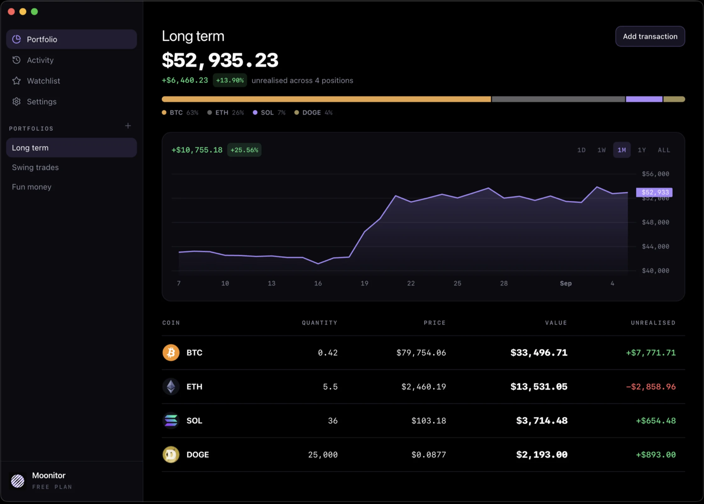

  

<h1 align="center">Moonitor</h1>

  Crypto portfolio tracker for macOS, Windows and Linux. 
  Your holdings stay on your machine.

  
  

  

## Download

  

Every link on this page resolves to the newest release, so none of them has a
version in it and none goes stale.

| Platform | Build | For |
| --- | --- | --- |
| macOS 12+ | [`.dmg`](https://moonitor.io/download/mac) | Apple Silicon and Intel, one universal build |
| Windows 10+ | [`.exe`](https://moonitor.io/download/windows) | Most people. Runs on 64-bit and Arm |
| | [`.msi`](https://moonitor.io/download/windows-msi) | Group Policy and Intune |
| | [`.exe` 64-bit](https://moonitor.io/download/windows-x64) · [`.exe` Arm](https://moonitor.io/download/windows-arm64) | A smaller download, if you know which you need |
| Linux | [`.deb`](https://moonitor.io/download/linux-deb) · [Arm](https://moonitor.io/download/linux-deb-arm64) | Debian, Ubuntu |
| | [`.rpm`](https://moonitor.io/download/linux-rpm) | Fedora, RHEL |
| | [AppImage](https://moonitor.io/download/linux-appimage) · [Arm](https://moonitor.io/download/linux-appimage-arm64) | Everything else |

On a Mac you can also get it from the
[Mac App Store](https://apps.apple.com/us/app/moonitor-crypto-portfolio/id6480369825),
which syncs with the iPhone app through iCloud, or from
[Setapp](https://go.setapp.com/stp219?utm_medium=vendor_program&utm_source=Moonitor&utm_content=link).

## Coming from Moonitor 3?

Version 4 is a rewrite. Download it here as you would a new app: a Moonitor 3
install will not update itself to it.

## About this repository

It holds the released builds and nothing else; the app itself is developed
privately. Questions and bug reports: [moonitor.io/support](https://moonitor.io/support)
